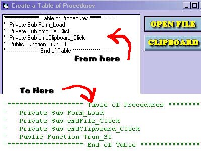



## Create a Table of Procedures

### Description

Use to make a list of the procedures in your app and paste them in like a table of contents. Hopefully it will be of some use. Had fun programming it anyways.
 
### More Info
 

             |
---                |---
**Submitted On**   |2004-11-15 07:51:54
**By**             |[Kenneth Foster](https://github.com/Planet-Source-Code/PSCIndex/blob/master/ByAuthor/kenneth-foster.md)
**Level**          |Intermediate
**User Rating**    |4.8 (24 globes from 5 users)
**Compatibility**  |VB 6\.0
**Category**       |[Complete Applications](https://github.com/Planet-Source-Code/PSCIndex/blob/master/ByCategory/complete-applications__1-27.md)
**World**          |[Visual Basic](https://github.com/Planet-Source-Code/PSCIndex/blob/master/ByWorld/visual-basic.md)
**Archive File**   |[Create\_a\_T18183611152004\.zip](https://github.com/Planet-Source-Code/kenneth-foster-create-a-table-of-procedures__1-57245/archive/master.zip)

